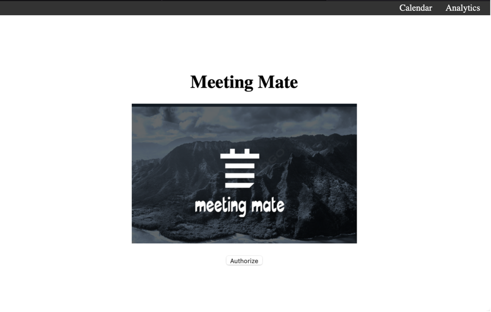
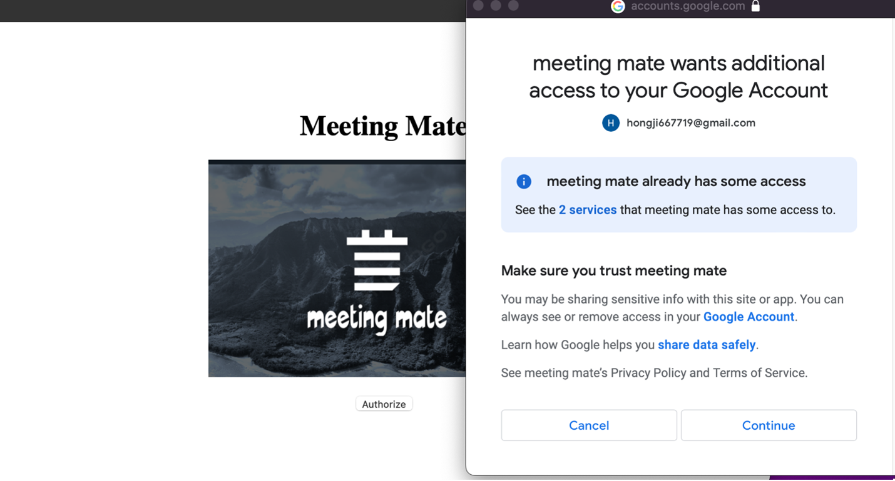
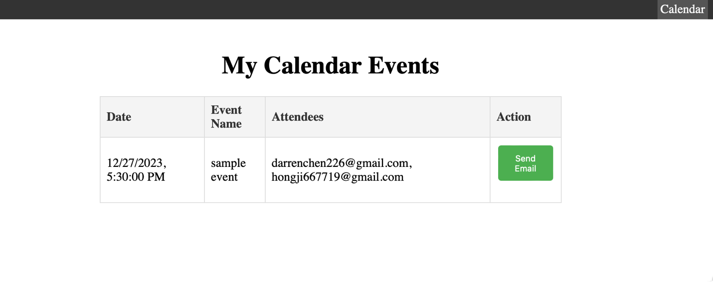
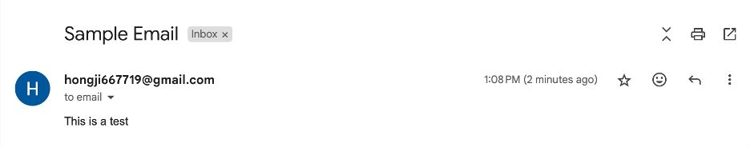

# MeetingMate, a calendar automation tool

This project is a demo for MeetingMate. It utilizes Google Calendar api and Google Gmail api to automate sending reminders to attendees of recent events.

## Usage

To demo this project, provide your own credentials and run the following scripts


```javascript
const CLIENT_ID = ''; // add client_ID
const API_KEY = ''; // add actual API key
```
- obtain your own credentials(client id and api key) from [Google Cloud Console](https://console.cloud.google.com/welcome/new)
- place them in the code snippet above at src/pages/home

```bash
npm install
npm install react-google-calendar-api@^2.3.0
npm install gapi-script@^1.2.0

npm start
```
- following the script above, the demo will be available at localhost:3000

## Demo


- a tentative landing page



- clicking on the Authorize button redirects users to a Google login page to allow access to user's calendar and gmail 



- the calendar page displays recent events of the user
- clicking on the send email button prompts the app to send emails from the user's email to attendees



## Roadmap

-- analytics page to provide insights on attendees based on previous data

